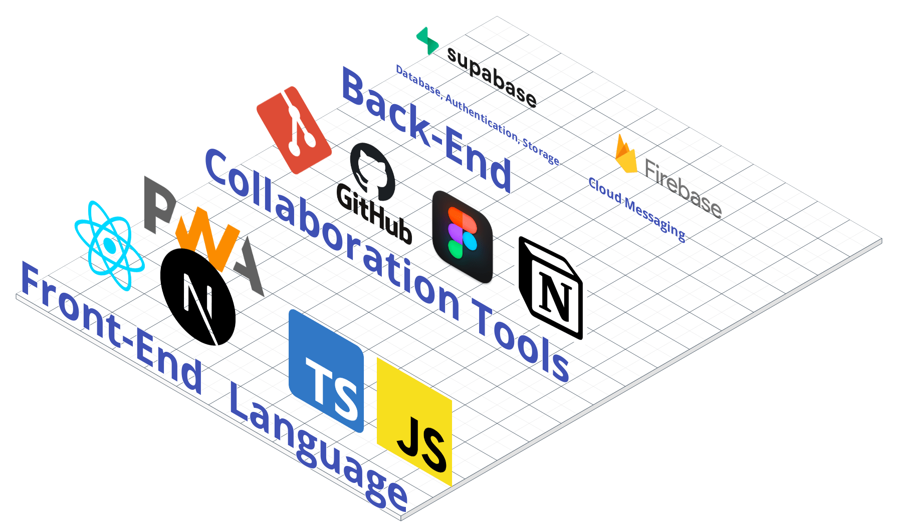

# Magic POS

- POS 관리자 주소 : [magic-pos.com](http://magic-pos.com)
- 모바일 키오스크 주소 : [magic-pos.com/kiosk](http://magic-pos.com/kiosk)

**- 프로젝트의 사용된 기술 :**<br>

- [FrontEnd] Next.js, React, TypeScript, JavaScript, Zustand, React-Query
- [BackEnd] (BasS) Supabase

**- 테스트 ID / PW <br>**

- ID: alcohol@test.com
- PW: testtest1!

### 메뉴 주문 및 확인 테스트 가이드

1. 테스트 아이디로 로그인 후 POS 관리자 페이지 접속 (메인 페이지에 `시작하기` 버튼 클릭)
2. 모바일로 키오스크 사이트 접속 후 하단 `QR 코드 이미지` 스캔하여 메뉴 주문
3. 관리자 페이지 POS 운영모드에서 주문된 내역 클릭 후 `주문완료하기` 버튼 클릭
4. 모바일 푸시 알림 확인

### QR 코드 이미지


## 프로젝트 소개


- 프로젝트명 : Magic POS
- 설명 : Magic POS는 가게와 고객 간 손쉬운 주문 및 결제를 위한 혁신적인 솔루션입니다. 사장님은 주문, 매출 관리등을 웹에서 간편하게 수행하며, 사용자는 직관적이고 빠른 주문 체험을 즐길 수 있습니다. 비즈니스 생산성과 소비자 만족도를 높이는 효과적인 어플리케이션 입니다!
- 개발기간 : 2024년 01월 04일 ~ 2024년 02월 08일

## 서비스 아키텍처


## 기술 스택



## 주요 기능

## POS

**`회원가입`** 사업자등록번호를 조회하여 실제 사업장 진위를 파악 후 회원가입을 할 수 있습니다.

**`운영 모드`** POS 운영 중일 때는 테이블 주문 및 매장 또는 포장 내역을 확인 하실 수 있고 관리 모드일 때는 일자별 매출 내역 및 메뉴, 카테고리 관리 등을 할 수 있도록 한 번의 클릭으로 간편하게 전환이 가능합니다.

**`주문 내역 확인`** 주문한 상품명과 개수 그리고 매장 & 포장별로 구분되어 있고 날짜별로 확인이 가능합니다.

**`매출 관리`** 일자, 주차, 월별로 확인이 가능하고 매출을 엑셀로 추출하여 가공하실 수도 있습니다.

**`플랫폼 관리`** 설정한 가게에 관련한 배달 플랫폼을 연결 시키거나 가게와 관련된 인사이트들을 모두 관리할 수 있는 공간입니다.

**`카테고리 관리`** 판매하고자 하는 상품 카테고리를 관리합니다.

**`메뉴 관리`** 메뉴명, 가격, 개수, 옵션 등을 정할 수 있고 가게의 시그니처 메뉴도 지정이 가능합니다.

**`가게 설정`** 오픈 & 마감 시간과 테이블 사용 유무를 설정하실 수 있습니다.

## KIOSK

**`메뉴 탐색`** 매장 또는 포장별로 주문하실 수 있습니다.

**`결제`** 토스 페이를 연동하여 간편하게 쉽고 빠르게 결제가 가능하며 신용 또는 체크 카드로도 결제가 가능합니다.

**`PWA`** 모바일에 최적화되어 있어 AOS는 앱 박스에 추가 & IOS는 Safari로 접속 후 가운데 공유하기 버튼 클릭 시 [홈 화면에 추가하기] 를 하면 어플 형태로 이용이 가능하도록 되어 있습니다. 더불어 주문 완료가 사장님께 접수되면 실시간으로 알림을 받아보실 수 있습니다. (키오스크 앱 내의 설명 표시가 되어 있습니다.)

## 코드 컨벤션

- 컴포넌트 파일은 **파스칼 케이스**로 작성
  `e.g) ComponentsTest.tsx`
- 페이지명은 `indexPage.ts` **(끝에 Page명 표기)**
- 일반 .ts 파일은 **케밥 케이스**로 작성 (ex. common.ts, date-helper.ts)
- app 폴더 하위 페이지 파일 이름은 **케밥 케이스**로 작성
- .module.css 파일은 컴포넌트 이름과 동일하게 작성!

### 컴포넌트 생성

- `rafce` 스니펫 사용

### 폴더 구조

```
project-root/
|📂 src/
|   |📂 assets
|   |📂 app
|   |   |📄 layout.tsx
|   |   |📄 not-found.tsx
|   |   |📄 page.tsx
|   |   |📂 login/
|   |   |   |📄 page.tsx
|   |📂 components/
|   |   |📂 layout/
|   |   |   |📄 Header.tsx
|   |   |   |📄 Content.tsx
|   |📂 types/
|   |   |📄 common.d.ts
|   |   |📄 supabase.d.ts
```

### 변수명 & 함수명

- **변수명**
  - 예약어는 **`const`** 로만 필요 시 **`let`**
  - 상수 (not, const, 하드코딩 값)는 모두 대문자로 작성하되, 단어 구분 필요 시 **`_`** 로 작성
    **`e.g) MAX_COUNT = 20`**
  - Boolean 타입에 관해서는 접두사 **`‘is’`** 사용
- **함수명**
  - 함수는 **단일 책임 원칙** (only 기능 1개)
  - 모든 함수 이름은 동사형으로 작성 **(카멜 케이스)**
    **`e.g) addComment, checkIsDone`**
  - **CRUD**
    - create: 접두사 add **`e.g) addCart...`**
    - read: 접두사 fetch **`e.g) fetchData ...`**
    - update: 접두사 update **`e.g) updateCart ...`**
    - delete: **`e.g) reomveCart ...`**
  - **Handler**
    - **`e.g) clickCartHandler ...`**
    - click기능명Handler
  - **React Query (Custom Hook)**
    - removeCartMutation = useMutaiton()…
      return { remove: removeCartMutation.mutate }

### Custom Hooks

- **hooks > user(폴더 - 페이지명) > useAuth(회원가입, 로그인 등등), useInput, useVaildate(파일)**
  - 폴더 → 페이지명, 파일 → use기능명
  - 더불어, 전역적으로 사용되는 Hook일 경우 **`common`** 폴더로 분리합니다.
- **react query를 custom hook으로 만들 경우**
  - **`useQuery`** 사용하는 hook과 **`useMutation`** 을 사용하는 hook으로 분리
  - **`useQuery`** 사용하는 훅 네이밍: ~~fetchQuery
  - **`useMutation`** 을 사용하는 훅 네이밍: ~~setQuery
- **zustand를 custom hook으로 만들 경우**
  - ~~State
  - **`e.g.) useOrderState`**

## 팀원 소개

|  이름  | 역할     | GitHub                        |
| :----: | -------- | ----------------------------- |
| 장예성 | 리더     | https://github.com/j-yesung   |
| 이상현 | 부리더   | https://github.com/4anghyeon  |
| 윤호준 | 팀원     | https://github.com/tjdsksro90 |
| 최문길 | 팀원     | https://github.com/lunaxislu  |
| 이동탁 | 팀원     | https://github.com/LeeDongTak |
| 민예진 | 디자이너 |                               |
